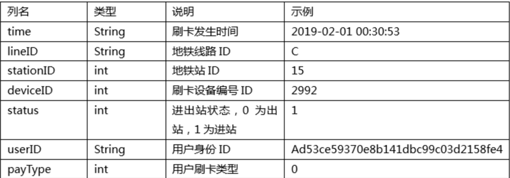
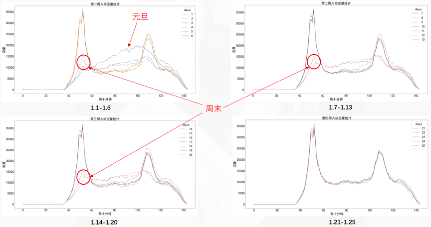
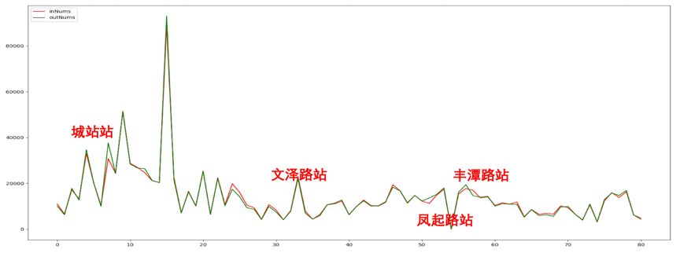
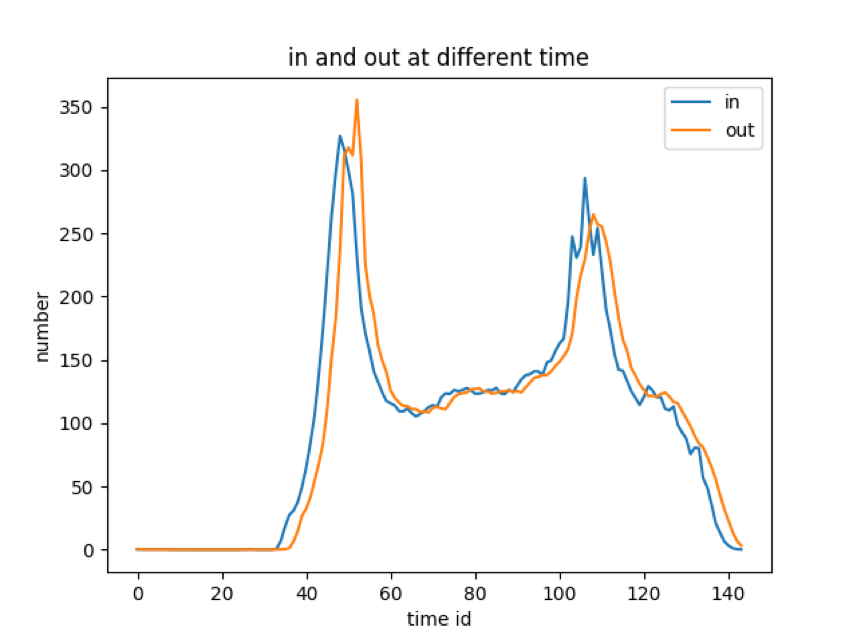
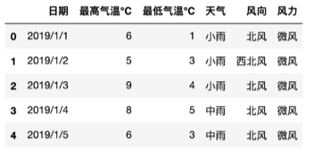
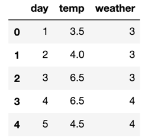
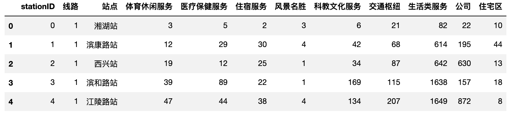
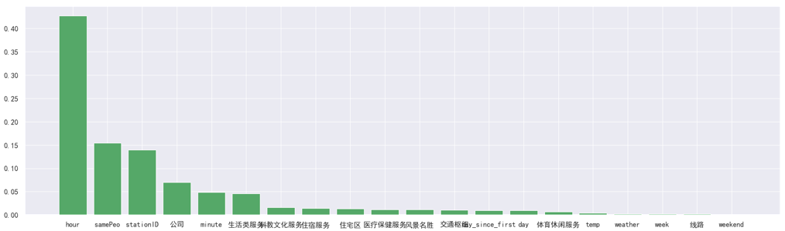

# TianChi_Metro_Predict

### 赛题简介

    大赛开放了杭州20190101至20190125共25天地铁刷卡数据记录，共涉及3条线路81个地铁站约7000万条数据作为训练数据（Metro_train.zip），供选手搭建地       铁站点乘客流量预测模型。训练数据（Metro_train.zip）解压后可以得到25个csv文件，每天的刷卡数据均单独存在一个csv文件中，以record为前缀。如2019年1    月1日的所有线路所有站点的刷卡数据记录存储在record_2019-01-01.csv文件中，以此类推。同时大赛提供了路网地图，即各地铁站之间的连接关系表，存储在文件    Metro_roadMap.csv文件中供选手使用。
[全球城市AI挑战赛](https://tianchi.aliyun.com/competition/entrance/231708/introduction)

### 思路过程及评价方式
在进行详细的数据分析之前，我们初步探究了一下本文提的难点。
  
      1)应该如何建模尽可能达到最大的预测准确性？
      2)应该如何选用分析的时间段？
      3)应该如何刻画每个时间段的时序特征？
      4)应该如何处理异常值并且保证模型稳定的情况？
信息论告诉我们：掌握更多信息，才能降低不确定性！因此在对问题进行建模求解之前，需要坚持重数据，轻模型的想法，尽可能理解数据背后的物理意义，还原真实世界！ 
我们选用平均绝对误差MAE（Mean Absolute Error）作为评价标准。
      
### 探索性数据分析
#### 1.单日单周的客流量统计可视化
      地铁的人流量与节假日、工作日和每天的时间段有很大的相关性。是否节假日与每天不同的时间段都会对地铁的人流量有很大的影响

#### 2.站点日均客流量及比较
      不同站点人流量会有很大的差别，重要的枢纽站点人流量负载会很大，靠近写字楼等集中工作地点站点早晚高峰会很明显，靠近旅游景点等站点可能会有偏向峰值的分布

#### 3.各站点平均客流量变化与时间的关系
      每天的高峰时间比较固定，出站高峰相对于进站高峰有一定的滞后，这个滞后在一定程度上可以反映乘客乘坐地铁单程平均所花费的时间

### 特征工程
#### 1.特征初步提取
      1)将原来非数值化的数据全部数值化
      2)将原来精确到秒的数据，按每十分钟进行人数统计
      3)添加了samePeo属性，该属性表明了同一站点同一天内重复人数的比例
      4)添加了day_since_first属性，该属性表明了距离第一天的天数（该数值越大，则表明第一天对这一天的影响越小）。
#### 2.探索更多特征
* 天气信息的获取和处理 
 

* 站点POI数据获取 

      1)获取地铁站点名称列表。
      2)使用高德地图地理编码API根据站点名称获取对应的经纬度坐标。
      3)使用高德地图POI搜索API根据站点经纬度查找站点附近特定类别的POI信息。

### 模型构建
#### 1.用全月的工作日预测28号
    首先采用所有的数据作为训练集训练，并没有考虑到训练集的日期与测试集28号的相关程度，所以得到的均方根误差较大
#### 2.用上周的工作日+全月的周一，预测28号
    在增加了POI特征并考虑了日期间相关联的因素后，随机森林模型的预测平均绝对误差降低到了14.74，这说明，日期间的相关性确实在很大程度上影响了预测呃结果。

#### 3.分站点预测
#### 4.分站点+分日期预测

### 模型比较
    添加POI特征的模型优于基础模型，而由于需预测的日子为周一，则通过上周工作日加上全月周一的分日期模型进行预测的效果最好

